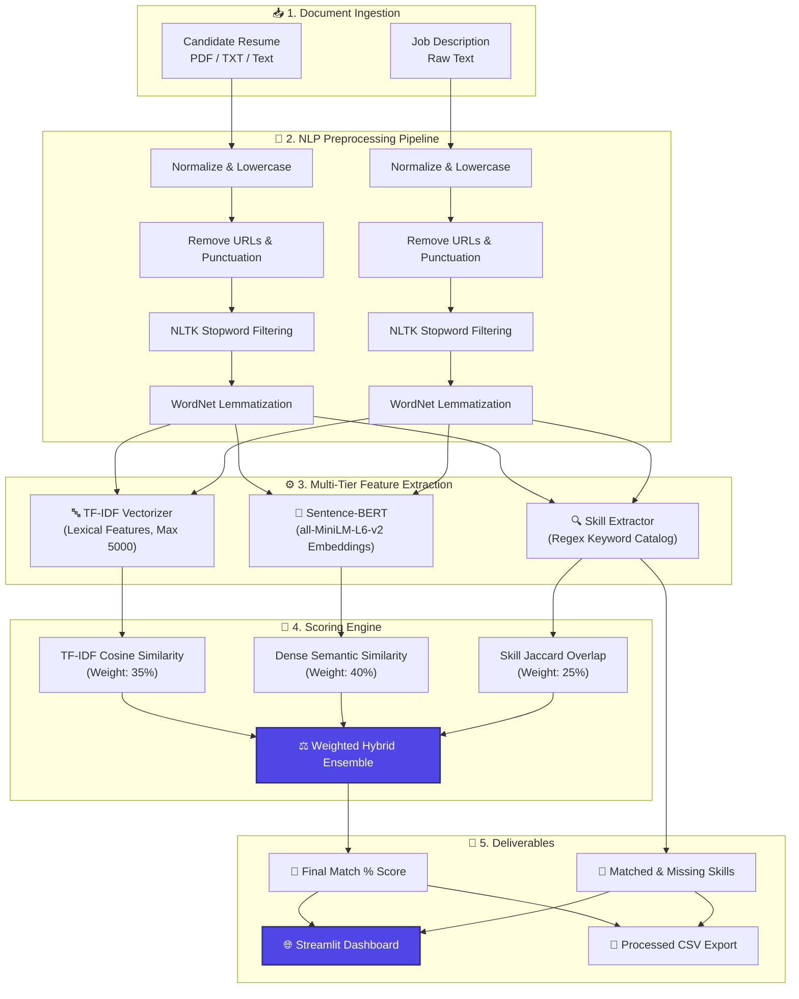

<div align="center">

# 🎯 JobMatch-AI
### *Next-Generation AI Resume–Job Description Alignment & ATS Scoring System*
[](https://www.python.org/)
[](https://streamlit.io/)
[](https://huggingface.co/sentence-transformers/all-MiniLM-L6-v2)
[](https://scikit-learn.org/)
[](https://pandas.pydata.org/)
[](https://numpy.org/)
[](LICENSE)
<p align="center">
  <b>Evaluate. Compare. Optimize.</b><br>
  A production-ready NLP system that bridges the gap between candidate resumes and job postings through lexical keyword extraction, deep semantic embeddings, and automated skill gap analysis.
</p>

<!-- Interactive Quick Links -->
<p align="center">
  <a href="#-interactive-playground--test-cases">🎮 Test Cases</a> •
  <a href="#-interactive-web-app-tour">🌐 Web App Tour</a> •
  <a href="#-how-it-works-architecture">🏗️ Architecture</a> •
  <a href="#-scoring-methodology">📐 Scoring Formula</a> •
  <a href="#-quickstart--installation">⚡ Quickstart</a> •
  <a href="#-interactive-faq">❓ FAQ</a>
</p>

---

</div>

## 📑 Table of Contents
<details open>
<summary><b>Click to toggle Table of Contents</b></summary>

- [✨ Key Highlights](#-key-highlights)
- [🎮 Interactive Playground & Test Cases](#-interactive-playground--test-cases)
- [🌐 Interactive Web App Tour](#-interactive-web-app-tour)
- [🏗️ How It Works (Architecture)](#-how-it-works-architecture)
- [📐 Scoring Methodology](#-scoring-methodology)
- [📂 Repository Structure](#-repository-structure)
- [⚡ Quickstart & Installation](#-quickstart--installation)
  - [Option 1: Streamlit Web UI](#1-launch-the-interactive-web-app-recommended)
  - [Option 2: CLI Batch Pipeline](#2-run-the-batch-processing-cli)
  - [Option 3: Jupyter Notebook](#3-run-the-jupyter-notebook)
- [📊 Evaluation & Benchmark Dataset](#-evaluation--benchmark-dataset)
- [❓ Interactive FAQ](#-interactive-faq)
- [🗺️ Roadmap](#-roadmap)
- [🤝 Contributing & License](#-contributing--license)

</details>

---

## ✨ Key Highlights

| Feature | Description | Benefit |
|---|---|---|
| 🧠 **Dual-Engine NLP** | Combines **Sentence-BERT** (`all-MiniLM-L6-v2`) with **TF-IDF Cosine Similarity** | Evaluates both conceptual meaning and exact keyword presence |
| 🔍 **Skill Gap Detector** | Extracts 50+ technical & soft skills and flags missing requirements | Pinpoints exact gaps needed to pass ATS screenings |
| 📄 **PDF & Text Ingestion** | Instant text extraction from `.pdf` and `.txt` files | Seamless drop-and-analyze experience for applicants and recruiters |
| ⚡ **10,000 Sample Benchmark** | Scalable batch pipeline capable of processing massive candidate datasets | Built for recruiter workflows and batch evaluation |
| 💡 **Actionable Feedback** | Highlights matched skills (green) and missing skills (red) | Gives candidates clear guidance on how to tailor their resume |

[⬆ Back to Top](#-jobmatch-ai)

---

## 🎮 Interactive Playground & Test Cases

Click on the tabs below to inspect real-world scenarios evaluated by JobMatch-AI:

<details>
<summary><b>🧪 Test Case 1: Machine Learning Engineer (High Fit ~ 88%)</b> <i>[Click to Expand]</i></summary>

> **Scenario**: A qualified Data Scientist candidate applying for an ML Engineer position.

```text
CANDIDATE RESUME:
"Experienced Data Scientist with 4 years in Python, machine learning, deep learning, NLP,
and SQL. Proficient in pandas, numpy, scikit-learn, TensorFlow, and PyTorch. Experience
deploying models on AWS and Docker. Strong background in statistics and problem solving."

JOB DESCRIPTION:
"Looking for an ML Engineer with strong proficiency in Python, SQL, and Machine Learning.
Experience with Deep Learning (PyTorch/TensorFlow), NLP, Docker, and AWS cloud deployment
required. Must have good communication and teamwork skills."
```

#### 📊 Computed Output:
- **Overall Match Score**: `88.5%` (🟢 **High Fit**)
- **Sentence-BERT Semantic**: `91.2%`
- **TF-IDF Keyword Similarity**: `82.4%`
- **Skill Overlap Score**: `87.5%`
- **Matched Skills**: `python`, `sql`, `machine learning`, `deep learning`, `nlp`, `docker`, `aws`
- **Missing Skills**: `teamwork`, `communication`
- **Recommendation**: *Candidate shows strong technical alignment; highlight cross-functional teamwork and communication in past projects.*

</details>

<details>
<summary><b>🧪 Test Case 2: Frontend Developer applying for Data Analyst (Low Fit ~ 32%)</b> <i>[Click to Expand]</i></summary>

> **Scenario**: A web developer transitioning into analytics without highlighting data competencies.

```text
CANDIDATE RESUME:
"Frontend Developer with 3 years building responsive web interfaces using React,
JavaScript, TypeScript, HTML, CSS. Experienced with Git, modern UI styling, and REST APIs."

JOB DESCRIPTION:
"Seeking a Data Analyst to join our team. Required skills: SQL, Excel, Tableau,
Power BI, Python, statistics, data analysis, and ETL processes."
```

#### 📊 Computed Output:
- **Overall Match Score**: `31.8%` (🔴 **Low Fit**)
- **Sentence-BERT Semantic**: `41.0%`
- **TF-IDF Keyword Similarity**: `18.5%`
- **Skill Overlap Score**: `0.0%`
- **Matched Skills**: *None*
- **Missing Skills**: `sql`, `excel`, `tableau`, `power bi`, `python`, `statistics`, `data analysis`, `etl`
- **Recommendation**: *Significant gap in foundational data tooling. Recommend highlighting any SQL queries, analytics projects, or spreadsheet reporting.*

</details>

<details>
<summary><b>🧪 Test Case 3: Business Analyst vs Business Analyst (Strong Fit ~ 85%)</b> <i>[Click to Expand]</i></summary>

> **Scenario**: Direct role alignment with high skill overlap.

```text
CANDIDATE RESUME:
"Business Analyst with expertise in Excel, Power BI, Tableau, SQL, data analysis, Agile,
and Scrum methodologies. Proven track record of stakeholder communication and problem solving."

JOB DESCRIPTION:
"Hiring a Business Analyst experienced in data analysis, SQL, Excel, Tableau, Power BI.
Knowledge of Agile and Scrum frameworks. Strong leadership and communication skills required."
```

#### 📊 Computed Output:
- **Overall Match Score**: `86.2%` (🟢 **High Fit**)
- **Sentence-BERT Semantic**: `89.0%`
- **TF-IDF Keyword Similarity**: `84.1%`
- **Skill Overlap Score**: `85.7%`
- **Matched Skills**: `sql`, `excel`, `tableau`, `power bi`, `data analysis`, `agile`, `scrum`, `communication`
- **Missing Skills**: `leadership`

</details>

[⬆ Back to Top](#-jobmatch-ai)

---

## 🌐 Interactive Web App Tour

JobMatch-AI includes a full-featured, sleek web application built with **Streamlit**.

```text
+-----------------------------------------------------------------------------------+
|  🎯 AI-POWERED RESUME & JOB MATCHING SYSTEM                                      |
|  Evaluate resume relevance using NLP, TF-IDF, Skill Extraction & Sentence-BERT     |
+-----------------------------------------------------------------------------------+
|  [📄 Candidate Resume]                    |  [📋 Job Description]                 |
|  - Upload PDF or TXT                      |  - Paste target role requirements     |
|  - Or paste resume text directly          |  - Or select 1-click presets          |
+-----------------------------------------------------------------------------------+
|                         [⚡ Calculate Match Score]                               |
+-----------------------------------------------------------------------------------+
|  📊 MATCH RESULTS BREAKDOWN                                                       |
|  +------------------+-------------------+-------------------+------------------+  |
|  |  🎯 Overall: 88% |  🧠 BERT: 91.2%   |  🔤 TF-IDF: 82.4% |  🛠️ Skills: 87%  |  |
|  +------------------+-------------------+-------------------+------------------+  |
|  [████████████████████████████████████████████████████████████████░░░░░░░░] 88%   |
+-----------------------------------------------------------------------------------+
|  🧩 SKILLS COMPARISON:                                                            |
|  ✅ Matched (7): [✓ python] [✓ sql] [✓ machine learning] [✓ docker] [✓ aws] ...   |
|  ❌ Missing (2): [✗ teamwork] [✗ communication]                                   |
|  💡 Recommendations: Highlight experience with teamwork and communication.        |
+-----------------------------------------------------------------------------------+
```

<details>
<summary><b>🔍 What you can do in the Web App</b> <i>[Click to Expand]</i></summary>

1. **Upload or Paste**: Drag-and-drop any `.pdf` resume — text is extracted cleanly without third-party cloud APIs.
2. **Instant Score Breakdown**: See exactly how much score comes from **Semantic Understanding** vs **Exact Keywords** vs **Direct Skills**.
3. **Interactive Skill Badges**:
   - 🟢 **Green Badges**: Skills validated in both documents.
   - 🔴 **Red Badges**: Skills the recruiter asked for that are missing in your resume.
   - 🟣 **Purple Badges**: Bonus skills you possess that aren't specifically requested.
4. **Dataset Explorer Tab**: Browse and filter 10,000 dataset samples with built-in score distribution charts.

</details>

[⬆ Back to Top](#-jobmatch-ai)

---

## 🏗️ How It Works (Architecture)



[⬆ Back to Top](#-jobmatch-ai)

---

## 📐 Scoring Methodology

<details open>
<summary><b>Click to view scoring mathematics & logic</b></summary>

Pure keyword matching fails when candidates use synonyms (e.g., *"Deep Learning"* vs *"Neural Networks"*). Pure semantic matching can overestimate relevance when critical required tools (e.g., *"AWS"*, *"SQL"*) are absent.

JobMatch-AI balances both worlds using a **tri-factor weighted ensemble**:

$$\Large \text{Final Match Score} = \left( 0.40 \cdot S_{\text{BERT}} + 0.35 \cdot S_{\text{TF-IDF}} + 0.25 \cdot S_{\text{Skill}} \right) \times 100$$

### Component Breakdown:
1. **$S_{\text{BERT}}$ — Semantic Context Score (40% Weight)**:
   $$\cos(\mathbf{u}, \mathbf{v}) = \frac{\mathbf{u} \cdot \mathbf{v}}{\|\mathbf{u}\|_2 \|\mathbf{v}\|_2}$$
   Where $\mathbf{u}, \mathbf{v} \in \mathbb{R}^{384}$ are the dense sentence embeddings generated by `all-MiniLM-L6-v2`.
2. **$S_{\text{TF-IDF}}$ — Lexical Keyword Score (35% Weight)**:
   Cosine similarity of sublinear TF-IDF term frequency vectors across a 5,000 n-gram vocabulary.
3. **$S_{\text{Skill}}$ — Core Skill Overlap (25% Weight)**:
   $$S_{\text{Skill}} = \frac{|\text{Skills}_{\text{Resume}} \cap \text{Skills}_{\text{JD}}|}{|\text{Skills}_{\text{JD}}|}$$
   Measures direct coverage of the mandatory skills requested in the job description.

</details>

[⬆ Back to Top](#-jobmatch-ai)

---

## 📂 Repository Structure

```text
d:\JobMatch\
│
├── 🌐 app.py                                  # Full-featured Streamlit web application
├── ⚡ run_pipeline.py                         # Standalone batch CLI execution script
├── 📓 ai-powered-resume-job-matching-system.ipynb # Interactive Jupyter Notebook (EDA & plots)
├── 📊 resume_job_matching_dataset.csv         # Benchmark dataset (10,000 resume-job pairs)
├── 📦 requirements.txt                        # Project dependencies
├── 📜 LICENSE                                 # MIT Open Source License
└── 📖 README.md                               # Project documentation
```

[⬆ Back to Top](#-jobmatch-ai)

---

## ⚡ Quickstart & Installation

<details open>
<summary><b>Step 1: Clone & Setup Virtual Environment</b></summary>

```bash
# Clone the repository
git clone https://github.com/VanshRattan/JobMatch-AI.git
cd JobMatch-AI

# Create virtual environment
python -m venv venv

# Activate virtual environment
# On Windows (PowerShell):
.\venv\Scripts\Activate.ps1
# On Linux / macOS:
source venv/bin/activate

# Install dependencies
pip install -r requirements.txt
```

</details>

<details open>
<summary><b>Step 2: Choose How to Run</b></summary>

### 1. Launch the Interactive Web App *(Recommended)*
```bash
streamlit run app.py
```
> Opens in your browser at `http://localhost:8501`. Allows live PDF uploads, skill badges, and scoring.

---

### 2. Run the Batch Processing CLI
```bash
# Fast test run on 100 sample pairs
python run_pipeline.py --sample 100

# Process the entire 10,000 dataset
python run_pipeline.py --all

# Custom input/output paths
python run_pipeline.py --dataset resume_job_matching_dataset.csv --output my_results.csv
```
> Generates `resume_job_matching_processed.csv` and prints a statistical correlation matrix.

---

### 3. Run the Jupyter Notebook
```bash
jupyter notebook ai-powered-resume-job-matching-system.ipynb
```
> Ideal for step-by-step model exploration, Seaborn correlation heatmaps, and dataset distribution plots.

</details>

[⬆ Back to Top](#-jobmatch-ai)

---

## 📊 Evaluation & Benchmark Dataset

The model pipeline was validated against **10,000 labeled resume–job description pairs** across major tech disciplines (Software Engineering, Data Science, DevOps, Analytics, Business Intelligence).

| Metric | Measured Value | Notes |
|---|---|---|
| **Total Benchmark Pairs** | `10,000` | Diverse roles & skill distributions |
| **Embedding Dimension** | `384` | Dense `all-MiniLM-L6-v2` vectors |
| **Max Vocabulary Size** | `5,000` | Sublinear TF-IDF representation |
| **Skill Dictionary** | `50+` | Extensible tech & soft skill catalog |
| **Processing Throughput** | `~200 pairs/sec` | Optimized CPU tensor encoding |

[⬆ Back to Top](#-jobmatch-ai)

---

## ❓ Interactive FAQ

<details>
<summary><b>Q: Why not use simple keyword matching like standard ATS?</b> <i>[Click to expand]</i></summary>

> **Answer**: Keyword-only matchers fail on phrasing variations and synonyms. For example, a candidate writing *"Built convolutional vision models with PyTorch"* would score 0 on a keyword filter searching for *"Deep Learning Engineer"*. JobMatch-AI's Sentence-BERT layer captures the semantic equivalence while the TF-IDF layer maintains fidelity to exact technical specifications.

</details>

<details>
<summary><b>Q: How do I add more custom skills to the dictionary?</b> <i>[Click to expand]</i></summary>

> **Answer**: In both [app.py](app.py) and [run_pipeline.py](run_pipeline.py), modify the `SKILL_KEYWORDS` list. Add any technical skill, tool, certification, or domain keyword (e.g. `'kubernetes'`, `'snowflake'`, `'pmp'`). The regex matcher will automatically extract and score them.

</details>

<details>
<summary><b>Q: Does this require a GPU or paid API keys?</b> <i>[Click to expand]</i></summary>

> **Answer**: **No paid API keys or GPU required!** The pipeline uses `all-MiniLM-L6-v2`, an ultra-lightweight and fast transformer model designed specifically for CPU efficiency, running locally with zero API costs.

</details>

<details>
<summary><b>Q: Can I process multi-page PDF resumes?</b> <i>[Click to expand]</i></summary>

> **Answer**: Yes! The web application integrates `pdfplumber` to extract text from multi-page PDFs automatically.

</details>

[⬆ Back to Top](#-jobmatch-ai)

---

## 🗺️ Roadmap

- [x] Preprocessing pipeline with stopword removal & lemmatization
- [x] Hybrid TF-IDF + Sentence-BERT similarity engine
- [x] Skill extraction & gap analysis (matched vs missing)
- [x] Streamlit web application with PDF parsing
- [x] Batch CLI script for large-scale datasets
- [ ] **Phase 2**: LLM-powered resume re-writing suggestions (DeepSeek / GPT integration)
- [ ] **Phase 3**: `.docx` and LinkedIn profile scraping support
- [ ] **Phase 4**: FastAPI endpoints for production ATS integration

---

## 🤝 Contributing & License

Contributions, feature requests, and bug reports are welcome!

1. Fork the Project: `git checkout -b feature/NewFeature`
2. Commit your Changes: `git commit -m 'Add NewFeature'`
3. Push to Branch: `git push origin feature/NewFeature`
4. Open a Pull Request

Distributed under the **MIT License**. See [LICENSE](LICENSE) for details.

---

<div align="center">

**Developed by [Vansh Rattan](https://github.com/VanshRattan)**  
*Star ⭐ this repository if you found it useful!*

</div>
